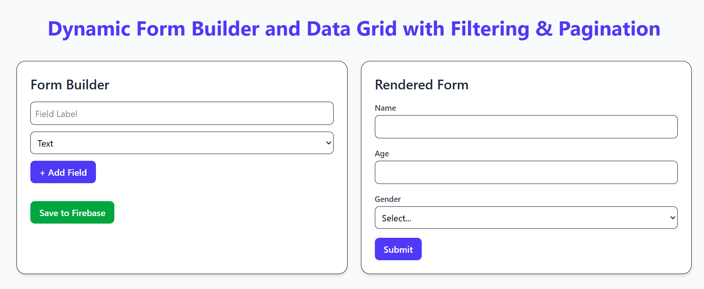
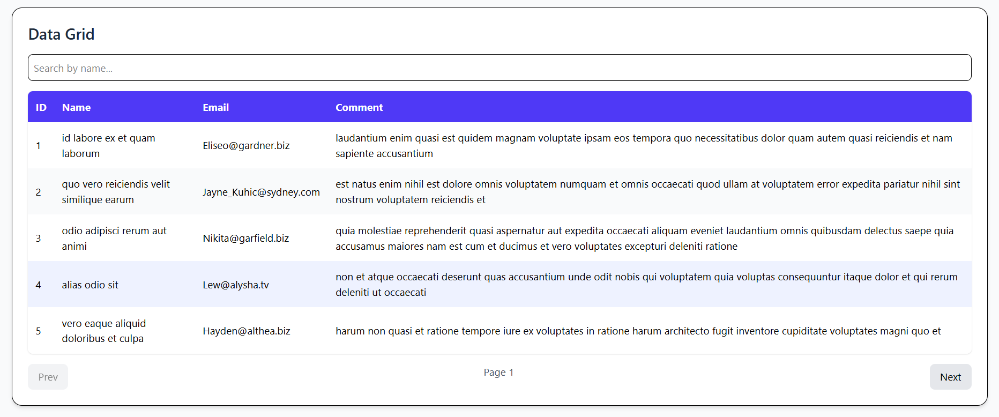

Dynamic Form Builder + Data Grid (React + Firebase + Vite)

live link:https://react-js-dynamic-form-builder.vercel.app/

This project is a React-based Dynamic Form Builder that allows users to create forms dynamically, render them in real-time, and store form configurations in Firebase Firestore.
Additionally, it includes a Data Grid component with filtering and pagination that fetches and displays data dynamically.

🚀 Features
🧱 Dynamic Form Builder

Add form fields dynamically — Text, Number, Date, Dropdown.

Define custom dropdown options (comma-separated).

Delete or reorder fields easily.

Save the entire form schema to Firebase Firestore.

Auto-render the saved form on the right side in real time.

📝 Rendered Form

Displays a live preview of the created form.

Accepts input values from users.

Submits user responses (can be extended to Firestore).

📊 Data Grid

Displays tabular data (fetched from JSONPlaceholder API).

Supports search/filtering and pagination.

Clean UI with Tailwind CSS styling.

🛠️ Tech Stack
Category	Technologies
Frontend	React.js (Vite)
Styling	Tailwind CSS
State Management	React Hooks
Database	Firebase Firestore
Hosting (optional)	Vercel / Firebase Hosting
⚙️ Folder Structure
my-dynamic-app/
├── public/
├── src/
│   ├── components/
│   │   ├── FormBuilder.jsx
│   │   ├── RenderedForm.jsx
│   │   ├── DataGrid.jsx
│   ├── firebase.js
│   ├── App.jsx
│   ├── main.jsx
│   ├── index.css
│
├── .env.local
├── package.json
├── tailwind.config.js
├── vite.config.js
└── README.md

🔧 Firebase Setup

Go to Firebase Console
.

Create a new Firebase project.

Enable Firestore Database (in test mode).

Copy your Firebase config and add it to .env.local:

VITE_FIREBASE_API_KEY=your_api_key
VITE_FIREBASE_AUTH_DOMAIN=your_auth_domain
VITE_FIREBASE_PROJECT_ID=your_project_id
VITE_FIREBASE_STORAGE_BUCKET=your_storage_bucket
VITE_FIREBASE_MESSAGING_SENDER_ID=your_messaging_sender_id
VITE_FIREBASE_APP_ID=your_app_id

 Firestore Structure
forms (Collection)
 └── form1 (Document)
     └── fields (Array)
         ├── { label: "Name", type: "text" }
         ├── { label: "Age", type: "number" }
         └── { label: "Gender", type: "dropdown", options: ["Male", "Female", "Other"] }

 Installation & Setup
# 1. Clone the repo
git clone https://github.com/yourusername/my-dynamic-app.git
cd my-dynamic-app

# 2. Install dependencies
npm install

# 3. Start the development server
npm run dev

Then open your browser at http://localhost:5173/

 UI Overview
Section	Description
Left Panel	Build your form dynamically (add, delete, and save fields).
Right Panel	Renders the live preview of your dynamic form.
Bottom Section	Displays a Data Grid with filtering and pagination.
 
 

 Dynamic Form Builder + Live Preview

Data Grid

 How It Works

User defines form fields using Form Builder.

The schema (array of field objects) is stored in Firebase Firestore.

The Rendered Form component listens to Firestore changes and updates dynamically.

The Data Grid fetches and displays mock data from an API.

Possible Improvements

Store user responses in Firestore.

Add drag-and-drop for reordering fields.

Add validation rules per field.

Integrate backend JSON schema for advanced dynamic rendering.

Add dark mode & animations using Framer Motion.

 Author

Rishikesh
FullStack Developer 
 LinkedIn:https://www.linkedin.com/in/rishikeshshaw/
 